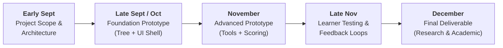

# Virtual Client Telehealth Simulation Platform

An interactive, mock-telehealth training platform designed for social work students and early-career therapists to practice clinical interview skills, establish rapport, navigate resistance, and respond to safety cues in an auditable, HIPAA-compliant simulation environment.

---

## Project Description

Practicing clinical interviews and navigating challenging client dynamics typically requires live actors or real clients, introducing high logistical barriers and strict HIPAA constraints. This platform provides a safe, reproducible virtual client simulation where social work learners practice interviewing techniques through open-ended dialogue and interactive clinical tools. 

Using a hybrid partial-AI architecture, student dialogue is mapped to structured decision-tree branches to maintain deterministic clinical accuracy, avoid hallucinations, and enforce rigorous rubric-based evaluation while preserving natural conversational flow.

---

## Key Features

### 1. Interaction & Response Logging

- **Full Audit Trail:** Captures every student input and virtual client output in chronological order with microsecond timestamps.
- **Deterministic Dialogue Tree:** Routes student text to clinically pre-approved virtual client dialogue nodes, avoiding unconstrained AI generation.
- **Session Metadata:** Records state transitions, active node history, and latency metrics for downstream grading and research review.

### 2. Automated AI & Rubric Evaluation

- **Objective Rubric Scoring:** Grades student performance against standardized clinical criteria (e.g., general A/B/C benchmarks and decision-point pass/fail triggers).
- **Safety Cue Recognition:** Flags whether a student appropriately acknowledged high-risk signals (such as bullying or self-harm statements) or bypassed critical intervention points.
- **Actionable Feedback:** Identifies missed opportunities to validate emotion, de-escalate resistance, or deploy clinical tools at optimal junctures.

### 3. Integrated Telehealth Tools

- **Interactive Whiteboard:** A shared visual canvas supporting real-time freehand drawing, typing, color selection, and erasing to facilitate co-participation exercises.
- **Emotion Check-In Sheet:** An emoji- and face-selection sheet where the virtual client circles, crosses out, or highlights feelings to express emotional state.
- **Structured Chess:** A game-based engagement tool supporting therapist-set behavioral rules (e.g., requiring the client to reflect or answer a question before each move) to address client deflection and resistance.

---

## Identified Technologies & Candidate Stacks

To support real-time user input, structured intent classification, canvas-based visual tools, and deterministic state transitions, three candidate technology stacks are under consideration:

| Stack Option         | Frontend Architecture                                                  | Backend Architecture                                                                                  | Strengths & Tradeoffs                                                                                     |
| -------------------- | ---------------------------------------------------------------------- | ----------------------------------------------------------------------------------------------------- | --------------------------------------------------------------------------------------------------------- |
| **Python Stack**     | • React 19 (Vite) • Tailwind CSS • HTML5 Canvas API           | • Python (FastAPI) • Pydantic / Instructor • Custom State Machine Engine              | Excellent native data science and LLM tool compatibility; decoupled client-server development.            |
| **TypeScript Stack** | • Next.js 15 (React) • Tailwind CSS • Fabric.js / React-Konva | • Node.js (Next.js Handlers / Fastify) • Zod + Vercel AI SDK • XState v5 (FSM)         | End-to-end type safety, unified language across stack, and enterprise-grade state machine management.     |
| **JavaScript Stack** | • React 18 (Vite) • Tailwind CSS • HTML5 Canvas API           | • Node.js (Express.js) • OpenAI Node SDK (Structured Outputs) • Robot / Machina.js FSM | Fast prototyping, low onboarding overhead, but lacks compile-time type validation across complex schemas. |

---

## Goals & Progress Plan

### Project Goals

- **Practical Clinical Training:** Enable social work learners to gain hands-on interview experience in a controlled telehealth environment.
- **Dynamic Skill Assessment:** Teach learners to establish rapport, navigate client resistance, validate emotional cues, and deploy clinical tools appropriately.
- **Standardized Rubric Evaluation:** Assess learner performance automatically against decision-point criteria and general rubrics developed by social work research partners.
- **Zero HIPAA Risk:** Provide high-fidelity, case-based simulation without the data privacy hazards or consent requirements of real-world patient records.

### Progress Plan & Milestones

* **Early September — Project Finalization:** Finalize architecture selection (Option 2), define technical stack, and document core system requirements.
* **Late September / Early October — Foundation Prototype:** Implement basic chat/text interface, decision-tree execution logic, and initial client state management.
* **November — Advanced Prototype:** Integrate 2–3 interactive tools (Whiteboard, Emotion Check-In, Chess) and deploy automated rubric-based feedback scoring.
* **Late November — Learner Evaluation & Feedback:** Conduct user-testing sessions with social work students; gather usability data and evaluate intent classification accuracy.
* **December — Final Deliverable:** Deliver production-ready release candidate supporting both academic project benchmarks and academic research deployment.